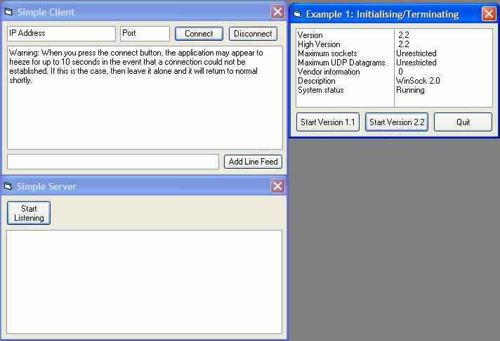



## Winsock API Explained

### Description

This is a tutorial which explains how to start off creating powerful network/internet applications using the Winsock API. The API allows far more control, power and speed in your application than the control ever would and is definetly something worth learning.
 
### More Info
 

             |
---                |---
**Submitted On**   |2003-01-03 00:45:42
**By**             |[IRBMe](https://github.com/Planet-Source-Code/PSCIndex/blob/master/ByAuthor/irbme.md)
**Level**          |Intermediate
**User Rating**    |4.5 (36 globes from 8 users)
**Compatibility**  |VB 5\.0, VB 6\.0
**Category**       |[Windows API Call/ Explanation](https://github.com/Planet-Source-Code/PSCIndex/blob/master/ByCategory/windows-api-call-explanation__1-39.md)
**World**          |[Visual Basic](https://github.com/Planet-Source-Code/PSCIndex/blob/master/ByWorld/visual-basic.md)
**Archive File**   |[Winsock\_AP156956452003\.zip](https://github.com/Planet-Source-Code/irbme-winsock-api-explained__1-44526/archive/master.zip)

### Source Code

Unfortunately PSC have added character limits and tag limits and a load of cr@p like that probably because of some 1diotic little 13 year olds trying to exploit them. So despite trying to shorten the tutorial and remove all the offending tags, I have been forced to simply ask you to download the word document.

